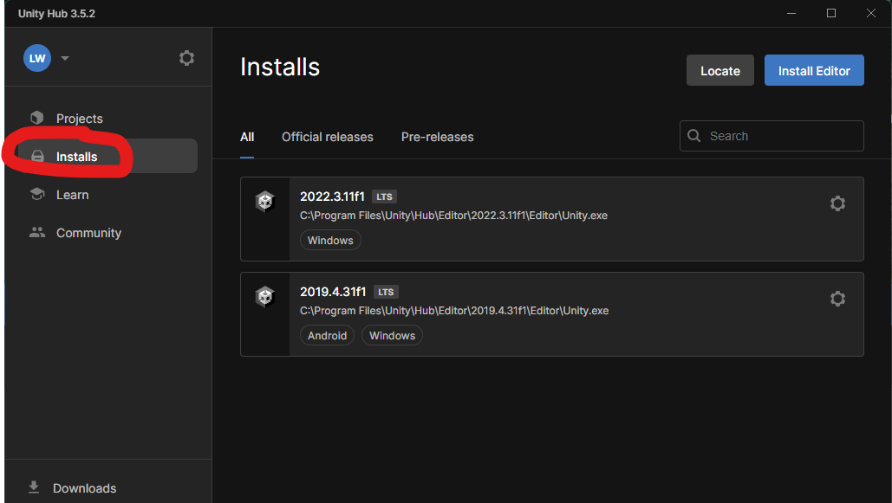
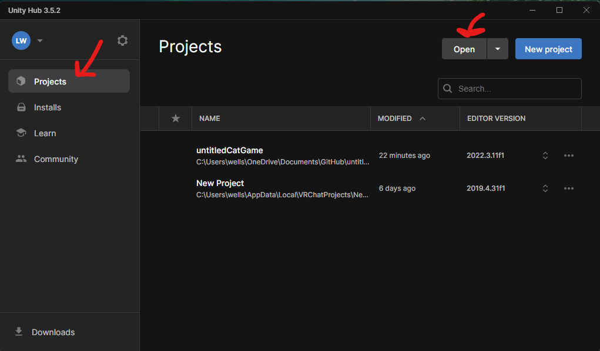
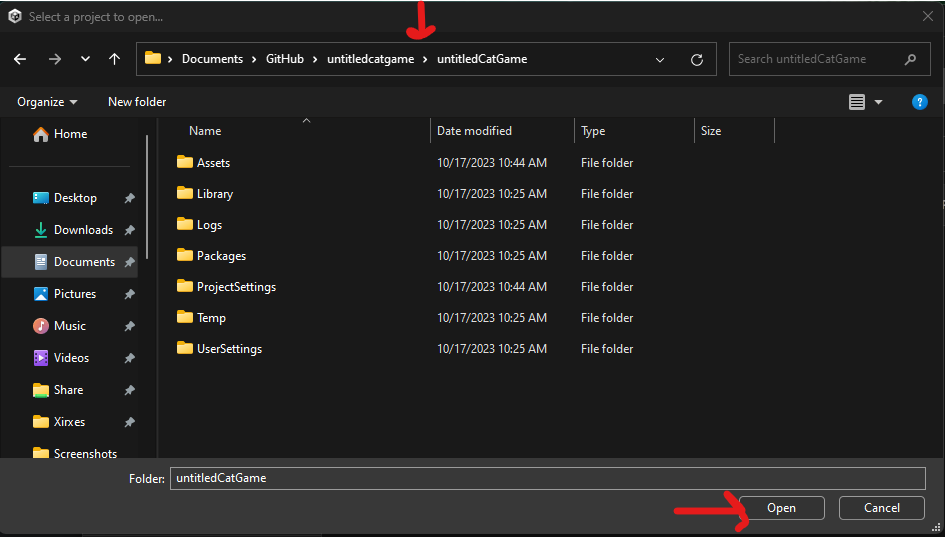

# untitledcatgame
We are creating a game in Unity similar to untitledgoosegame, but you play as a cat. This is for our Computer Graphics project at UTD.

---- 
# Getting Started Developing
1. Get Git
	- ***WAIT*** to actually clone the repository until step 3
	1. Option 1, use Github Desktop (easy, **recommended** for windows)
		1. [Click here](https://desktop.github.com/) and click the big download button
		2. This should download git for you, and also a friendly app that will let you manage git repositories from Github easily
		3. This probably works on Mac as well but I don't have a Mac so I'm not sure
	2. Option 2, just download Git directly
		- [Go to this website](https://git-scm.com/download/win) and download the git installer for windows
		- If you are on a different platform, follow the instructions [here](https://git-scm.com/book/en/v2/Getting-Started-Installing-Git)
		- **Note:** For most of this I'm going to assume you used Github Desktop because it makes things easier, though it's certainly possible without it if you're familiar with git from the command line
1. Download Git LFS
	- This is required to track files larger than 100mb with git, which is something we could easily otherwise have a problem with with our project
	1. Follow the download instructions [here](https://git-lfs.com/)
	2. In a terminal, run `git lfs install`
2. Clone the repository from Github
	1. If using Github Desktop, this is easy
		1. In the top left click File -> Clone repository
		2. Enter the name of our repository, untitledCatGame
3. Get Unity Hub
	1. Go [here](https://unity.com/download) and click the big blue download button
	2. Activate your free license
	3. On the left, select the installs tab
		1. 
	4. Then click "Install Editor" and choose 2022.3.11f1 LTS
		- The last 4 digits of that version may be slightly different depending on when you set this up, that should be fine
4. Open the project in Unity
	1. On that left area from before, click projects, then click open
		- 
	2. Navigate to where you cloned the repository from github, then click "Open"
		- **NOTE:** The repository is called "untitledcatgame", and the unity project inside of it is called "untitledCatGame".
			- Make sure you open the unity project folder
		- 

----
# How to save your changes to Github
1. From Github Desktop, create a new branch
	1. 
2. Name this branch like this "yourName-somethingDescriptive"
	- Always push your changes into your own branch, you can select it after you create it then just keep pushing changes to it
	- 
3. **Do not** push changes directly into main, (it probably won't let you lol)
	- We will merge the personal branches into main as people make progress
	- This prevents stuff from being broken and lost after it's been committed to the main branch

